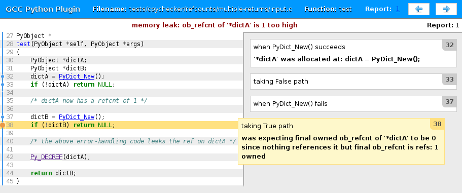

.. Copyright 2014 David Malcolm <dmalcolm@redhat.com>
   Copyright 2014 Red Hat, Inc.

   This is free software: you can redistribute it and/or modify it
   under the terms of the GNU General Public License as published by
   the Free Software Foundation, either version 3 of the License, or
   (at your option) any later version.

   This program is distributed in the hope that it will be useful, but
   WITHOUT ANY WARRANTY; without even the implied warranty of
   MERCHANTABILITY or FITNESS FOR A PARTICULAR PURPOSE.  See the GNU
   General Public License for more details.

   You should have received a copy of the GNU General Public License
   along with this program.  If not, see
   <http://www.gnu.org/licenses/>.

.. this covers up to ef48966bc952d2af637e6a34e92846af2c2210bf

0.13
~~~~

The major features in this release are:

  * gcc 4.9 compatibility

  * a major revamping to the HTML output from gcc-with-cpychecker

Changes to the GCC Python Plugin
================================

GCC 4.9 compatibility
---------------------

This release of the plugin adds support for gcc 4.9 (along with continued
support for gcc 4.6, 4.7 and gcc 4.8).

Building against 4.9 requires a GCC 4.9 with the fix for
`GCC bug 63410 <https://gcc.gnu.org/bugzilla/show_bug.cgi?id=63410>`_ applied.

Other fixes
-----------
* fixed a build-time incompatibility with Python 3.3.0
* various internal bug fixes:

  * bug in garbage-collector integration (https://bugzilla.redhat.com/show_bug.cgi?id=864314)

  * the test suite is now parallelized (using multiprocessing)

* improvements to Makefile
* improvements to documentation
* add gcc.Location.in_system_header attribute

Improvements to :doc:`gcc-with-cpychecker </cpychecker>`
========================================================

The major improvement to :doc:`gcc-with-cpychecker </cpychecker>` is a big
revamp of the output.

A new "v2" HTML report is available, written to ``SOURCE_NAME.v2.html``
e.g. ``demo.c.v2.html``:

The new HTML report is easier to read in the presence of complicated
control flow.  It also include links to the API documentation for
calls made to the CPython API.

For both old-style and new-style reports, the wording of the messages has
been clarified:

  * Reference-count tracking messages now largely eliminate the
    ``0 + N where N >=`` gobbledegook, since this was confusing to
    everyone (including me).  Instead, error reports
    talk about references as owned vs borrowed references e.g.

    * "refs: 1 owned"

    * "refs: 0 owned 1 borrowed"

    resorting to ranges::

      refs: 0 owned + B borrowed where 1 <= B <= 0x80000000

    only where necessary.

  * Reports now add ``memory leak:`` and ``future use-after-free:``
    prefixes where appropriate, to better indicate the issue.

  * Objects are referred to more in terms the user is likely to
    understand e.g. ``*dictA`` rather than ``PyDictObject``.

The checker also reports better source locations in its messages
e.g. in the presence of multiple ``return`` statements
(https://fedorahosted.org/gcc-python-plugin/ticket/58).

.. The v2 html output was first added in 0.10, but was "experimental", and
   required hacking to access.

Other improvements
------------------
* Add a new test script: `tests/examples/find-global-state`, showing
  examples of finding global state in the code being compiled.
* handle :c:func:`PySequence_DelItem`
* fix bug in handling of :c:func:`PyRun_SimpleStringFlags`
* fix issue with handling of :c:func:`PyArg_ParseTuple`
  (https://fedorahosted.org/gcc-python-plugin/ticket/50)
* although we don't model the internals of C++ exceptions, fix things so
  we don't crash with a traceback in the absense of ``-fno-exceptions``
  (https://fedorahosted.org/gcc-python-plugin/ticket/51)

Contributors
============
Thanks to Buck Golemon, Denis Efremov, Philip Herron, and Tom Tromey for
their contributions to this release.
