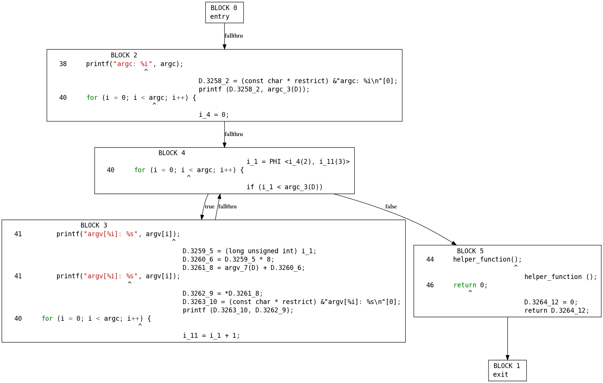

.. Copyright 2011 David Malcolm <dmalcolm@redhat.com>
   Copyright 2011 Red Hat, Inc.

   This is free software: you can redistribute it and/or modify it
   under the terms of the GNU General Public License as published by
   the Free Software Foundation, either version 3 of the License, or
   (at your option) any later version.

   This program is distributed in the hope that it will be useful, but
   WITHOUT ANY WARRANTY; without even the implied warranty of
   MERCHANTABILITY or FITNESS FOR A PARTICULAR PURPOSE.  See the GNU
   General Public License for more details.

   You should have received a copy of the GNU General Public License
   along with this program.  If not, see
   <http://www.gnu.org/licenses/>.

Overview of GCC's internals
===========================

.. TODO: Subprocesses

.. TODO: Passes

.. TODO: could use a diagram  here showing all the passes

To add a new compiler warning to GCC, it's helpful to have a high-level
understanding of how GCC works, so here's the 10,000 foot view of how GCC turns
source code into machine code.

The short version is that GCC applies a series of optimization passes to your
code, gradually converting it from a high-level representation into machine
code, via several different internal representations.

Each programming language supported by GCC has a "frontend", which parses the
source files.

For the case of C and C++, the preprocessor manipulates the code first
before the frontend sees it.  You can see the preprocessor output with the
`-E` option.

Exactly what happens in each frontend varies by language: some language
frontends emit language-specific trees, and some convert to a
language-independent tree representation known as `GENERIC`.  In any case, we
eventually we reach a representation known as `GIMPLE`.  The GIMPLE
representation contains simplified operations, with temporary variables added as
necessary to avoid nested sub-expressions.

For example, given this C code:

   .. literalinclude:: ../test.c
     :lines: 33-48
     :language: c

we can see a dump of a C-like representation of the GIMPLE form by passing
`-fdump-tree-gimple` to the command-line:

  .. code-block:: bash

      $ gcc -fdump-tree-gimple test.c
      $ cat test.c.004t.gimple

giving something like this:

.. code-block:: c

   main (int argc, char * * argv)
   {
     const char * restrict D.3258;
     long unsigned int D.3259;
     long unsigned int D.3260;
     char * * D.3261;
     char * D.3262;
     const char * restrict D.3263;
     int D.3264;
     int i;

     D.3258 = (const char * restrict) &"argc: %i\n"[0];
     printf (D.3258, argc);
     i = 0;
     goto <D.2050>;
     <D.2049>:
     D.3259 = (long unsigned int) i;
     D.3260 = D.3259 * 8;
     D.3261 = argv + D.3260;
     D.3262 = *D.3261;
     D.3263 = (const char * restrict) &"argv[%i]: %s\n"[0];
     printf (D.3263, D.3262);
     i = i + 1;
     <D.2050>:
     if (i < argc) goto <D.2049>; else goto <D.2051>;
     <D.2051>:
     helper_function ();
     D.3264 = 0;
     return D.3264;
   }

It's far easier to see the GIMPLE using:

.. code-block:: bash

  ./gcc-with-python examples/show-gimple.py test.c

which generates bitmaps showing the "control flow graph" of the functions in
the file, with source on the left-hand side, and GIMPLE on the right-hand side:

    .. figure:: sample-gimple-cfg.png
      :scale: 50 %
      :alt: image of a control flow graph in GIMPLE form

Each function is divided into "basic blocks".  Each basic block consists of a
straight-line sequence of code with a single entrypoint and exit: all branching
happens between basic blocks, not within them.  The basic blocks form a
"control flow graph" of basic blocks, linked together by edges.  Each block
can contain a list of :py:class:`gcc.Gimple` statements.

You can work with this representation from Python using :py:class:`gcc.Cfg`

Once the code is in GIMPLE form, GCC then attempts a series of optimizations on
it.

Some of these optimizations are listed here:
http://gcc.gnu.org/onlinedocs/gccint/Tree-SSA-passes.html

If you're looking to add new compiler warnings, it's probably best to hook
your code into these early passes.

The GIMPLE representation actually has several forms:

  * an initial "high gimple" form, potentially containing certain high-level
    operations (e.g. control flow, exception handling)

  * the lower level gimple forms, as each of these operations are rewritten
    in lower-level terms (turning control flow from jumps into a CFG etc)

  * the SSA form of GIMPLE.  In Static Single Assignment form, every variable
    is assigned to at most once, with additional versions of variables added
    to help track the impact of assignments on the data flowing through
    a function.  See http://gcc.gnu.org/onlinedocs/gccint/SSA.html

You can tell what form a function is in by looking at the flags of the current
pass.  For example::

   if ps.properties_provided & gcc.PROP_cfg:
      # ...then this gcc.Function ought to have a gcc.Cfg:
      do_something_with_cfg(fn.cfg)

   if ps.properties_provided & gcc.PROP_ssa:
      # ...then we have SSA data
      do_something_with_ssa(fn)

Here's our example function, after conversion to GIMPLE SSA:

.. code-block:: bash

  ./gcc-with-python examples/show-ssa.py test.c

You can see that the local variable `i` has been split into three versions:

   * `i_4`, assigned to in block 2
   * `i_11`, assigned to at the end of block 3
   * `i_1`, assigned to at the top of block 4.

As is normal with SSA, GCC inserts fake functions known as "PHI" at the start
of basic blocks where needed in order to merge the multiple possible values of
a variable.  You can see one in our example at the top of the loop in block 4:

.. code-block:: c

   i_1 = PHI <i_4(2), i_11(3)>

where i_1 either gets the value of i_4, or of i_11, depending on whether we
reach here via block 2 (at the start of the iteration) or block 3 (continuing
the "for" loop).

After these optimizations passes are done, GCC converts the GIMPLE SSA
representation into a lower-level representation known as Register Transfer
Language (RTL).  This is probably too low-level to be of interest to those
seeking to add new compiler warnings: at this point it's attempting to work
with the available opcodes and registers on the target CPU with the aim of
generating efficient machine code.

See http://gcc.gnu.org/onlinedocs/gccint/RTL.html

The RTL form uses the same Control Flow Graph machinery as the GIMPLE
representation, but with RTL expressions within the basic blocks.

Once in RTL, GCC applies a series of further optimizations, before finally
generating assembly language (which it submits to `as`, the GNU assembler):
http://gcc.gnu.org/onlinedocs/gccint/RTL-passes.html
You can see the assembly language using the `-S` command line option.

.. code-block:: bash

  $ ./gcc -S test.c
  $ cat test.s
