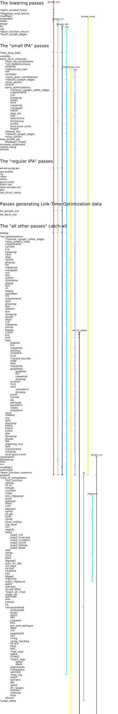

.. This file is autogenerated, using:
   ./gcc-with-python generate-tables-of-passes-rst.py test.c

All of GCC's passes
===================

This diagram shows the various GCC optimization passes, arranged vertically,
showing child passes via indentation.

The lifetime of the various properties that they maintain is shown, giving
the pass that initially creates the data (if any), the pass that destroys it
(if any), and each pass that requires a particular property (based on the
PROP_* flags).

These tables contain the same information.  The diagram and tables were
autogenerated, using GCC 4.6.0

.. _all_lowering_passes:

The lowering passes
-------------------

   ======================  ===================  ===================  ====================
   Pass Name               Required properties  Provided properties  Destroyed properties
   ======================  ===================  ===================  ====================
   \*warn_unused_result    gimple_any
   \*diagnose_omp_blocks   gimple_any
   mudflap1                gimple_any
   omplower                gimple_any           gimple_lomp
   lower                   gimple_any           gimple_lcf
   ehopt                   gimple_lcf
   eh                      gimple_lcf           gimple_leh
   cfg                     gimple_leh           cfg
   \*warn_function_return  cfg
   \*build_cgraph_edges    cfg
   ======================  ===================  ===================  ====================

.. _all_small_ipa_passes:

The "small IPA" passes
----------------------

   ================================  =======================================  ===================  ====================
   Pass Name                         Required properties                      Provided properties  Destroyed properties
   ================================  =======================================  ===================  ====================
   \*free_lang_data                  gimple_any, gimple_lcf, gimple_leh, cfg
   visibility
   early_local_cleanups
   > \*free_cfg_annotations          cfg
   > \*init_datastructures           cfg
   > ompexp                          gimple_any
   > \*referenced_vars               gimple_leh, cfg                          referenced_vars
   > ssa                             cfg, referenced_vars                     ssa
   > veclower                        cfg
   > \*early_warn_uninitialized      ssa
   > \*rebuild_cgraph_edges          cfg
   > inline_param
   > einline
   > early_optimizations
   > > \*remove_cgraph_callee_edges
   > > copyrename                    cfg, ssa
   > > ccp                           cfg, ssa
   > > forwprop                      cfg, ssa
   > > ealias                        cfg, ssa
   > > esra                          cfg, ssa
   > > copyprop                      cfg, ssa
   > > mergephi                      cfg, ssa
   > > cddce                         cfg, ssa
   > > eipa_sra
   > > tailr                         cfg, ssa
   > > switchconv                    cfg, ssa
   > > ehcleanup                     gimple_lcf
   > > profile                       cfg
   > > local-pure-const
   > > fnsplit                       cfg
   > release_ssa                     ssa
   > \*rebuild_cgraph_edges          cfg
   > inline_param
   tree_profile_ipa
   > feedback_fnsplit                cfg
   increase_alignment
   matrix-reorg
   emutls                            cfg, ssa
   ================================  =======================================  ===================  ====================

.. _all_regular_ipa_passes:

The "regular IPA" passes
------------------------

   ================  =======================================  ===================  ====================
   Pass Name         Required properties                      Provided properties  Destroyed properties
   ================  =======================================  ===================  ====================
   whole-program     gimple_any, gimple_lcf, gimple_leh, cfg
   ipa-profile
   cp
   cdtor
   inline
   pure-const
   static-var
   type-escape-var
   pta
   ipa_struct_reorg
   ================  =======================================  ===================  ====================

.. _all_lto_gen_passes:

Passes generating Link-Time Optimization data
---------------------------------------------

   ==============  =======================================  ===================  ====================
   Pass Name       Required properties                      Provided properties  Destroyed properties
   ==============  =======================================  ===================  ====================
   lto_gimple_out  gimple_any, gimple_lcf, gimple_leh, cfg
   lto_decls_out
   ==============  =======================================  ===================  ====================

.. _all_passes:

The "all other passes" catch-all
--------------------------------

   ==============================  =======================================  ===================  ====================================================
   Pass Name                       Required properties                      Provided properties  Destroyed properties
   ==============================  =======================================  ===================  ====================================================
   ehdisp                          gimple_any, gimple_lcf, gimple_leh, cfg
   \*all_optimizations
   > \*remove_cgraph_callee_edges
   > \*strip_predict_hints         cfg
   > copyrename                    cfg, ssa
   > cunrolli                      cfg, ssa
   > ccp                           cfg, ssa
   > forwprop                      cfg, ssa
   > cdce                          cfg, ssa
   > alias                         cfg, ssa
   > retslot                       ssa
   > phiprop                       cfg, ssa
   > fre                           cfg, ssa
   > copyprop                      cfg, ssa
   > mergephi                      cfg, ssa
   > vrp                           ssa
   > dce                           cfg, ssa
   > cselim                        cfg, ssa
   > ifcombine                     cfg, ssa
   > phiopt                        cfg, ssa
   > tailr                         cfg, ssa
   > ch                            cfg, ssa
   > stdarg                        cfg, ssa
   > cplxlower                     ssa                                      gimple_lcx
   > sra                           cfg, ssa
   > copyrename                    cfg, ssa
   > dom                           cfg, ssa
   > phicprop                      cfg, ssa
   > dse                           cfg, ssa
   > reassoc                       cfg, ssa
   > dce                           cfg, ssa
   > forwprop                      cfg, ssa
   > phiopt                        cfg, ssa
   > objsz                         cfg, ssa
   > ccp                           cfg, ssa
   > copyprop                      cfg, ssa
   > sincos                        ssa
   > bswap                         ssa
   > crited                        cfg                                      no_crit_edges
   > pre                           cfg, ssa, no_crit_edges
   > sink                          cfg, ssa, no_crit_edges
   > loop                          cfg
   > > loopinit                    cfg
   > > lim                         cfg
   > > copyprop                    cfg, ssa
   > > dceloop                     cfg, ssa
   > > unswitch                    cfg
   > > sccp                        cfg, ssa
   > > \*record_bounds             cfg, ssa
   > > ckdd                        cfg, ssa
   > > ldist                       cfg, ssa
   > > copyprop                    cfg, ssa
   > > graphite0                   cfg, ssa
   > > > graphite                  cfg, ssa
   > > > lim                       cfg
   > > > copyprop                  cfg, ssa
   > > > dceloop                   cfg, ssa
   > > ivcanon                     cfg, ssa
   > > ifcvt                       cfg, ssa
   > > vect                        cfg, ssa
   > > > veclower2                 cfg
   > > > dceloop                   cfg, ssa
   > > pcom                        cfg
   > > cunroll                     cfg, ssa
   > > slp                         cfg, ssa
   > > parloops                    cfg, ssa
   > > aprefetch                   cfg, ssa
   > > ivopts                      cfg, ssa
   > > loopdone                    cfg
   > recip                         ssa
   > reassoc                       cfg, ssa
   > vrp                           ssa
   > dom                           cfg, ssa
   > phicprop                      cfg, ssa
   > cddce                         cfg, ssa
   > tracer
   > uninit                        ssa
   > dse                           cfg, ssa
   > forwprop                      cfg, ssa
   > phiopt                        cfg, ssa
   > fab                           cfg, ssa
   > widening_mul                  ssa
   > tailc                         cfg, ssa
   > copyrename                    cfg, ssa
   > uncprop                       cfg, ssa
   > local-pure-const
   cplxlower0                      cfg                                      gimple_lcx
   ehcleanup                       gimple_lcf
   resx                            gimple_lcf
   nrv                             cfg, ssa
   mudflap2                        gimple_leh, cfg, ssa
   optimized                       cfg
   \*warn_function_noreturn        cfg
   expand                          gimple_leh, cfg, ssa, gimple_lcx         rtl                  gimple_any, gimple_lcf, gimple_leh, ssa, gimple_lomp
   \*rest_of_compilation           rtl
   > \*init_function
   > sibling
   > rtl eh
   > initvals
   > unshare
   > vregs
   > into_cfglayout                                                         cfglayout
   > jump
   > subreg1
   > dfinit
   > cse1
   > fwprop1
   > cprop                         cfglayout
   > rtl pre                       cfglayout
   > hoist                         cfglayout
   > cprop                         cfglayout
   > store_motion                  cfglayout
   > cse_local
   > ce1
   > reginfo
   > loop2
   > > loop2_init
   > > loop2_invariant
   > > loop2_unswitch
   > > loop2_unroll
   > > loop2_doloop
   > > loop2_done
   > web
   > cprop                         cfglayout
   > cse2
   > dse1
   > fwprop2
   > auto_inc_dec
   > init-regs
   > ud dce
   > combine                       cfglayout
   > ce2
   > bbpart                        cfglayout
   > regmove
   > outof_cfglayout                                                                             cfglayout
   > split1
   > subreg2
   > no-opt dfinit
   > \*stack_ptr_mod
   > mode_sw
   > asmcons
   > sms
   > sched1
   > ira
   > \*all-postreload              rtl
   > > postreload
   > > gcse2
   > > split2
   > > zee
   > > cmpelim
   > > btl1
   > > pro_and_epilogue
   > > dse2
   > > csa
   > > peephole2
   > > ce3
   > > rnreg
   > > cprop_hardreg
   > > rtl dce
   > > bbro
   > > btl2
   > > \*leaf_regs
   > > split4
   > > sched2
   > > \*stack_regs
   > > > split3
   > > > stack
   > > alignments
   > > compgotos
   > > vartrack
   > > \*free_cfg                                                                                cfg
   > > mach
   > > barriers
   > > dbr
   > > split5
   > > eh_ranges
   > > shorten
   > > nothrow
   > > final
   > dfinish
   \*clean_state                                                                                 rtl
   ==============================  =======================================  ===================  ====================================================

